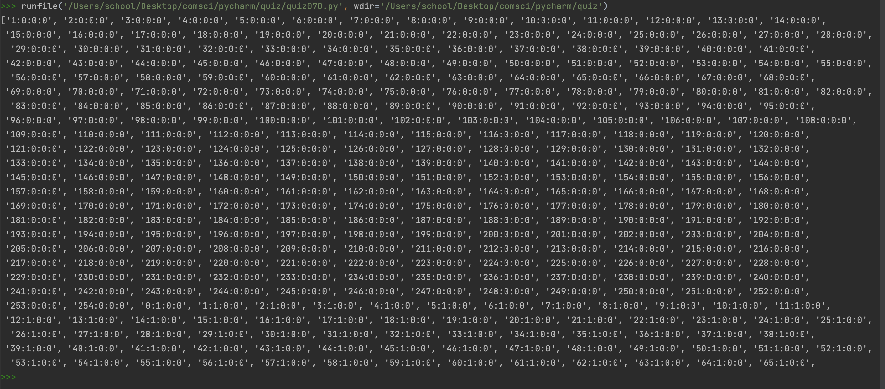
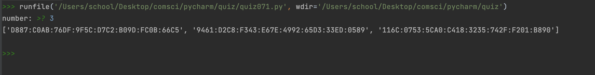
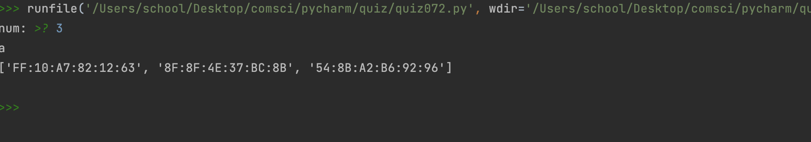
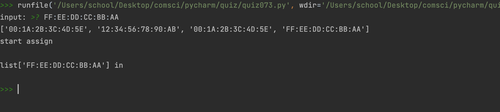
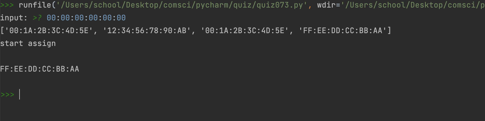
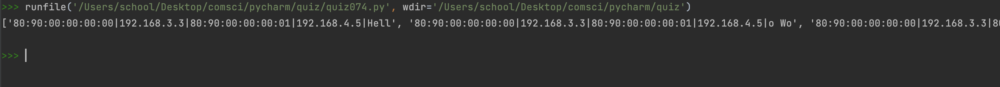
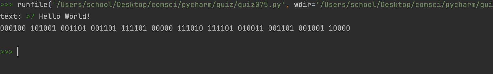
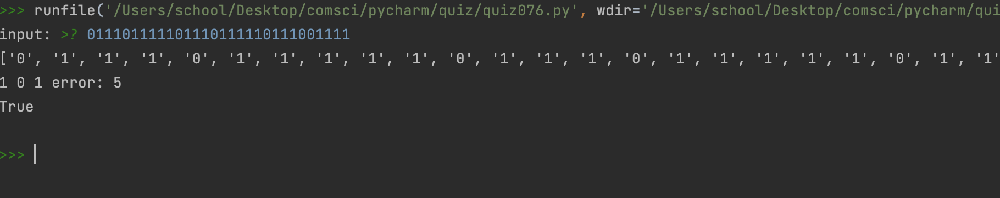
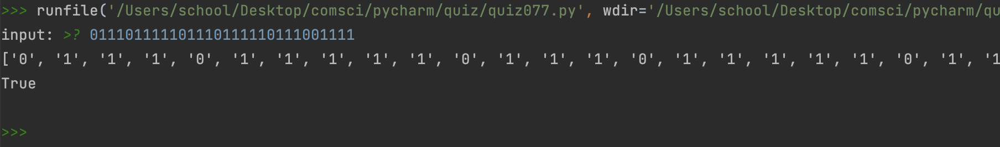

# quiz70

```.py
def ipv4():
    list = []
    a = 0
    b = 0
    c = 0
    d = 0

    for i in range(255**4):
        a += 1
        if a == 255:
            a=0
            b+=1
        if b == 255:
            b= 0
            c += 1
        if c == 255:
            c = 0
            d += 1
        result = f"{a}:{b}:{c}:{d}"
#        print(list)
        list.append(result)

    return print(list)

ipv4()
```



# 71
```.py

from random import randint

class ipv6machine():
    def __init__(self):
        self.generator(input('number: '))
    def dec2hex(self,n):
        list=['A','B','C','D','E','F']
        if n>9:
            return list[n-10]
        else:
            return n
    def generator(self,n):
        ip=[]
        for i in range(int(n)):
            value = ''
            for j in range(8):

                for k in range(4):
                    num = self.dec2hex(randint(0,15))
                    value += str(num)
                value += ':'
            value = value[:-1]
            ip.append(value)
        return print(ip)

ipv6machine()
```



# 72
```.py
from random import randint
class mac():
    def __init__(self):
        self.macGenerator(input('num: '))
    def convert(self,n):
        list=['A','B','C','D','E','F']
        if n>9:
            return list[n-10]
        else:
            return n
    def macGenerator(self,n):
        print('a')
        list = []
        for i in range(int(n)):
            s = ''
            for i in range(17):
                if (i+1)%3 == 0:
                    s +=':'
                else:

                    s += str(self.convert(randint(0,15)))
            list.append(s)
        return print(list)
mac()
```



# 73
```.py
class routing():
    def __init__(self):
        self.list = ["00:1A:2B:3C:4D:5E","12:34:56:78:90:AB","00:1A:2B:3C:4D:5E","FF:EE:DD:CC:BB:AA"]
        self.assign(input('input: '))
    def valid(self,n):
        v = 'iv'
        n = n
        while v == 'iv':
            if len(n)==17:
                a = n.split(':')
#                print(a,len(a))
                if len(a) == 6:
                    v = 'v'
                    return n
            if v == 'iv':
                n = input('input: ')


    def assign(self,n):
        print(self.list)
        print('start assign\n')
        n = self.valid(n)
#        print(n)

        if n in self.list:
            print(list[n],'in')
        else:
            print(self.list[-1])
            self.list.append(str(n))


routing()
```




# 74
```.py
class DataPackage:
    def __init__(self, Mac_rx, IP_rx, Mac_sx, IP_sx, data):
        self.Mac_rx = Mac_rx
        self.IP_rx = IP_rx
        self.Mac_sx = Mac_sx
        self.IP_sx = IP_sx
        self.data = data

    def build_data(self):
        result = []
        c = len(self.data) // 4
        leftover = len(self.data) % 4
        for i in range(c):
            temp_data = self.data[i*4:(i+1)*4]
            result.append(f"{self.Mac_rx}|{self.IP_rx}|{self.Mac_sx}|{self.IP_sx}|{temp_data}")
        if leftover:
            temp_data = self.data[-leftover:]
            result.append(f"{self.Mac_rx}|{self.IP_rx}|{self.Mac_sx}|{self.IP_sx}|{temp_data}")
        return result


temp_class = DataPackage("80:90:00:00:00:00","192.168.3.3","80:90:00:00:00:01","192.168.4.5","Hello World")
print(temp_class.build_data())
```


# 75
```.py
class osi():
    def __init__(self):
        self.osi(input('text: '))

    def convert(self,n):
        n = ord(n)
        v = ''
        while n > 1:
            v += str(n % 2)
            n = n // 2
        return v

    def osi(self,n):
        v = ''
        for i in n:
            v += self.convert(i)
        print(v)

osi()
```


# 76
```.py
x = []
j = 0
for i in input('input: '):
    x.append(i)
print(x)
v = False
for i in range(len(x)//3):
    if x[i] != x[i+2*(len(x))//3] and x[i] != x[i+len(x)//3-1]:
        print(x[i], x[i + 2 * (len(x)) // 3], x[i + len(x) // 3])
        v = True
#    else:
#        print('np')
print(v)
```


# 77
```.py
str = [i for i in input('input: ')]
par = str[0]
c = 0
print(str)
for i in range(1,len(str)):
    c += int(str[i])

if (c%2 == 0 and par == '1') or (c%2 == 1 and par == '0'):
    print(True)
else:
    print(False)
```


